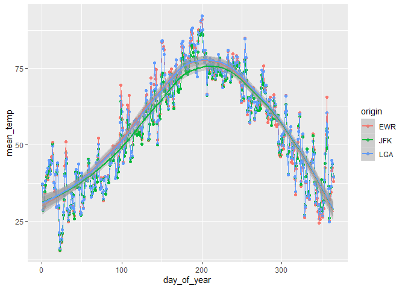

Practice Exam
=============

This practice exam asks you to do several code wrangling tasks that we
have done in class so far.

Clone this repo into Rstudio and fill in the necessary code. Then,
commit and push to github. Finally, turn in a link to canvas.

    ## -- Attaching packages -------------------------------------------------------------- tidyverse 1.3.0 --

    ## v ggplot2 3.2.1     v purrr   0.3.3
    ## v tibble  2.1.3     v dplyr   0.8.3
    ## v tidyr   1.0.0     v stringr 1.4.0
    ## v readr   1.3.1     v forcats 0.4.0

    ## -- Conflicts ----------------------------------------------------------------- tidyverse_conflicts() --
    ## x dplyr::filter() masks stats::filter()
    ## x dplyr::lag()    masks stats::lag()

Make a plot with three facets, one for each airport in the weather data.
The x-axis should be the day of the year (1:365) and the y-axis should
be the mean temperature recorded on that day, at that airport.

    library(lubridate)

    ## 
    ## Attaching package: 'lubridate'

    ## The following object is masked from 'package:base':
    ## 
    ##     date

    weather %>% mutate(day_of_year = yday(time_hour)) %>% 
      group_by(origin, day_of_year) %>% 
      summarise(mean_temp = mean(temp, na.rm = T)) %>% 
      ggplot(aes(x = day_of_year, y = mean_temp, color = origin)) +
      geom_point() +
      geom_line() +
      geom_smooth()

    ## `geom_smooth()` using method = 'loess' and formula 'y ~ x'

**The temperature of each origin have almost same pattern. Increase
first, reach peak around 200th day, then decrease. This reasonable since
the three airports are all in NY.**

Make a non-tidy matrix of that data where each row is an airport and
each column is a day of the year.

    weather %>% mutate(day_of_year = yday(time_hour)) %>% 
      group_by(origin, day_of_year) %>% 
      summarise(mean_temp = mean(temp, na.rm = T)) %>%
      pivot_wider(names_from = day_of_year, values_from = mean_temp)

    ## # A tibble: 3 x 365
    ## # Groups:   origin [3]
    ##   origin   `1`   `2`   `3`   `4`   `5`   `6`   `7`   `8`   `9`  `10`  `11`  `12`
    ##   <chr>  <dbl> <dbl> <dbl> <dbl> <dbl> <dbl> <dbl> <dbl> <dbl> <dbl> <dbl> <dbl>
    ## 1 EWR     36.8  28.7  29.6  34.3  36.6  39.9  40.3  38.6  42.1  43.6  42.0  46.0
    ## 2 JFK     36.9  28.6  30.1  34.7  36.8  39.3  40.1  39.4  42.7  43.6  41.3  45.0
    ## 3 LGA     37.2  28.8  30.3  35.8  38.3  41.0  41.4  42.3  44.9  44.3  40.3  43.9
    ## # ... with 352 more variables: `13` <dbl>, `14` <dbl>, `15` <dbl>, `16` <dbl>,
    ## #   `17` <dbl>, `18` <dbl>, `19` <dbl>, `20` <dbl>, `21` <dbl>, `22` <dbl>,
    ## #   `23` <dbl>, `24` <dbl>, `25` <dbl>, `26` <dbl>, `27` <dbl>, `28` <dbl>,
    ## #   `29` <dbl>, `30` <dbl>, `31` <dbl>, `32` <dbl>, `33` <dbl>, `34` <dbl>,
    ## #   `35` <dbl>, `36` <dbl>, `37` <dbl>, `38` <dbl>, `39` <dbl>, `40` <dbl>,
    ## #   `41` <dbl>, `42` <dbl>, `43` <dbl>, `44` <dbl>, `45` <dbl>, `46` <dbl>,
    ## #   `47` <dbl>, `48` <dbl>, `49` <dbl>, `50` <dbl>, `51` <dbl>, `52` <dbl>,
    ## #   `53` <dbl>, `54` <dbl>, `55` <dbl>, `56` <dbl>, `57` <dbl>, `58` <dbl>,
    ## #   `59` <dbl>, `60` <dbl>, `61` <dbl>, `62` <dbl>, `63` <dbl>, `64` <dbl>,
    ## #   `65` <dbl>, `66` <dbl>, `67` <dbl>, `68` <dbl>, `69` <dbl>, `70` <dbl>,
    ## #   `71` <dbl>, `72` <dbl>, `73` <dbl>, `74` <dbl>, `75` <dbl>, `76` <dbl>,
    ## #   `77` <dbl>, `78` <dbl>, `79` <dbl>, `80` <dbl>, `81` <dbl>, `82` <dbl>,
    ## #   `83` <dbl>, `84` <dbl>, `85` <dbl>, `86` <dbl>, `87` <dbl>, `88` <dbl>,
    ## #   `89` <dbl>, `90` <dbl>, `91` <dbl>, `92` <dbl>, `93` <dbl>, `94` <dbl>,
    ## #   `95` <dbl>, `96` <dbl>, `97` <dbl>, `98` <dbl>, `99` <dbl>, `100` <dbl>,
    ## #   `101` <dbl>, `102` <dbl>, `103` <dbl>, `104` <dbl>, `105` <dbl>,
    ## #   `106` <dbl>, `107` <dbl>, `108` <dbl>, `109` <dbl>, `110` <dbl>,
    ## #   `111` <dbl>, `112` <dbl>, ...

For each (airport, day) contruct a tidy data set of the airport’s
“performance” as the proportion of flights that departed less than an
hour late.

    n = flights %>% 
      group_by(origin, year, month, day) %>% 
      count()
    performance = flights %>% 
      group_by(origin, year, month, day) %>% 
      filter(!is.na(dep_delay), dep_delay<60) %>% 
      count() %>%   
      left_join(n, by = c("origin","year","month","day"), suffix = c("_Less60Delay", "_Total")) %>% 
      mutate(performance = n_Less60Delay/n_Total)
    performance

    ## # A tibble: 1,095 x 7
    ## # Groups:   origin, year, month, day [1,095]
    ##    origin  year month   day n_Less60Delay n_Total performance
    ##    <chr>  <int> <int> <int>         <int>   <int>       <dbl>
    ##  1 EWR     2013     1     1           279     305       0.915
    ##  2 EWR     2013     1     2           288     350       0.823
    ##  3 EWR     2013     1     3           326     336       0.970
    ##  4 EWR     2013     1     4           315     339       0.929
    ##  5 EWR     2013     1     5           229     238       0.962
    ##  6 EWR     2013     1     6           285     301       0.947
    ##  7 EWR     2013     1     7           315     342       0.921
    ##  8 EWR     2013     1     8           326     334       0.976
    ##  9 EWR     2013     1     9           327     336       0.973
    ## 10 EWR     2013     1    10           336     344       0.977
    ## # ... with 1,085 more rows

Construct a tidy data set to that give weather summaries for each
(airport, day). Use the total precipitation, minimum visibility, maximum
wind\_gust, and average wind\_speed.

    weather_summary = weather %>% 
      group_by(origin, year, month, day) %>% 
      summarise(TotalPrecip = sum(precip, na.rm = T),
                MinVisb = min(visib, na.rm = T),
                AvgWindSpeed = mean(wind_speed, na.rm = T))
    weather_summary

    ## # A tibble: 1,092 x 7
    ## # Groups:   origin, year, month [36]
    ##    origin  year month   day TotalPrecip MinVisb AvgWindSpeed
    ##    <chr>  <int> <int> <int>       <dbl>   <dbl>        <dbl>
    ##  1 EWR     2013     1     1           0      10        13.2 
    ##  2 EWR     2013     1     2           0      10        10.9 
    ##  3 EWR     2013     1     3           0      10         8.58
    ##  4 EWR     2013     1     4           0      10        14.0 
    ##  5 EWR     2013     1     5           0      10         9.40
    ##  6 EWR     2013     1     6           0       6         9.11
    ##  7 EWR     2013     1     7           0      10         7.34
    ##  8 EWR     2013     1     8           0       8         7.19
    ##  9 EWR     2013     1     9           0       6         5.99
    ## 10 EWR     2013     1    10           0      10         8.92
    ## # ... with 1,082 more rows

Construct a linear model to predict the performance of each
(airport,day) using the weather summaries and a “fixed effect” (dummy
variable for airport) for each airport. Display the summaries.

    data = left_join(performance, weather_summary, by = c("origin","year","month","day"))
    m = lm(performance~origin+TotalPrecip+MinVisb+AvgWindSpeed, data)
    summary(m)

    ## 
    ## Call:
    ## lm(formula = performance ~ origin + TotalPrecip + MinVisb + AvgWindSpeed, 
    ##     data = data)
    ## 
    ## Residuals:
    ##      Min       1Q   Median       3Q      Max 
    ## -0.48233 -0.02133  0.02037  0.04548  0.24018 
    ## 
    ## Coefficients:
    ##                Estimate Std. Error t value Pr(>|t|)    
    ## (Intercept)   0.8260821  0.0105907  78.001  < 2e-16 ***
    ## originJFK     0.0329332  0.0068358   4.818 1.66e-06 ***
    ## originLGA     0.0200635  0.0067232   2.984  0.00291 ** 
    ## TotalPrecip  -0.0661011  0.0100461  -6.580 7.31e-11 ***
    ## MinVisb       0.0125846  0.0009002  13.980  < 2e-16 ***
    ## AvgWindSpeed -0.0031213  0.0006675  -4.676 3.29e-06 ***
    ## ---
    ## Signif. codes:  0 '***' 0.001 '**' 0.01 '*' 0.05 '.' 0.1 ' ' 1
    ## 
    ## Residual standard error: 0.09006 on 1086 degrees of freedom
    ##   (3 observations deleted due to missingness)
    ## Multiple R-squared:  0.304,  Adjusted R-squared:  0.3008 
    ## F-statistic: 94.85 on 5 and 1086 DF,  p-value: < 2.2e-16

Repeat the above, but only for EWR. Obviously, exclude the fixed effect
for each airport.

    EWRdata = data %>% filter(origin == "EWR")
    mEWR = lm(performance~TotalPrecip+MinVisb+AvgWindSpeed, EWRdata)
    summary(mEWR)

    ## 
    ## Call:
    ## lm(formula = performance ~ TotalPrecip + MinVisb + AvgWindSpeed, 
    ##     data = EWRdata)
    ## 
    ## Residuals:
    ##      Min       1Q   Median       3Q      Max 
    ## -0.37268 -0.03529  0.02258  0.05254  0.25066 
    ## 
    ## Coefficients:
    ##               Estimate Std. Error t value Pr(>|t|)    
    ## (Intercept)   0.823186   0.016908  48.687  < 2e-16 ***
    ## TotalPrecip  -0.065640   0.016828  -3.901 0.000114 ***
    ## MinVisb       0.014317   0.001674   8.554 3.47e-16 ***
    ## AvgWindSpeed -0.004208   0.001122  -3.750 0.000206 ***
    ## ---
    ## Signif. codes:  0 '***' 0.001 '**' 0.01 '*' 0.05 '.' 0.1 ' ' 1
    ## 
    ## Residual standard error: 0.09309 on 360 degrees of freedom
    ##   (1 observation deleted due to missingness)
    ## Multiple R-squared:  0.3208, Adjusted R-squared:  0.3152 
    ## F-statistic: 56.69 on 3 and 360 DF,  p-value: < 2.2e-16
